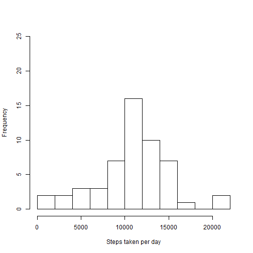
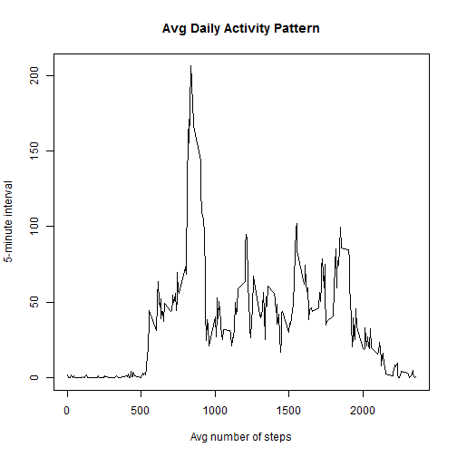
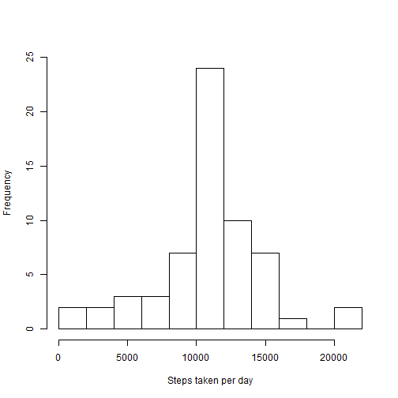
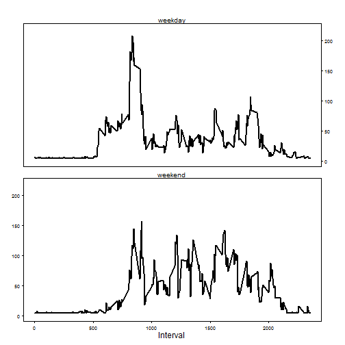

Loading and preprocessing the data
====================================

First of all, download the data for the analysis from the following link to your working directory:

https://d396qusza40orc.cloudfront.net/repdata%2Fdata%2Factivity.zip

QUESTIONS:

Show any code that is needed to:

1) Load the data (i.e. read.csv())

2) Process/transform the data (if necessary) into a format suitable for your analysis

ANSWER:

```r
data <- read.table(unz("repdata_data_activity.zip", "activity.csv"), header=T, quote="\"", sep=",")
```

```
## Warning in open.connection(file, "rt"): cannot open zip file
## 'repdata_data_activity.zip'
```

```
## Error in open.connection(file, "rt"): cannot open the connection
```


What is mean total number of steps taken per day?
====================================================

For this part of the assignment, you can ignore the missing values in the dataset.

QUESTIONS:
1. Make a histogram of the total number of steps taken each day

2. Calculate and report the mean and median total number of steps taken per day

ANSWERS:
1.

```r
sum1<-as.table(by(data$steps,data$date,sum,na.rm=FALSE))
hist1<-hist(sum1,breaks=10,xlab="Steps taken per day",main=NULL,ylim=range(0:25))
```

 

2.

```r
mean1<-mean(sum1,na.rm=TRUE)
median1<-median(sum1,na.rm=TRUE)
mean1
```

```
## [1] 10766.19
```

```r
median1
```

```
## [1] 10765
```

What is the average daily activity pattern?
===========================================

QUESTIONS:

1. Make a time series plot (i.e. type = "l") of the 5-minute interval (x-axis) and the average number of steps taken, averaged across all days (y-axis)

2. Which 5-minute interval, on average across all the days in the dataset, contains the maximum number of steps?


ANSWERS:

1.The code to generate the requested graph is the following:

```r
v1<-as.vector(tapply(data$steps,data$interval,mean,na.rm=TRUE)) #mean number of steps per interval
v2<-unique(data$interval)    #list of intervals
plot(v2,v1,type="l",xlab="Avg number of steps",ylab="5-minute interval",main="Avg Daily Activity Pattern")
```

 

2. From the graph is easy to see that the interval with the max value is somewhere around 800-900; in order to determine the exact one, we build a dataframe from v1 and v2, and collect the value for v2 where v1 is maximized, in this case 835.


```r
set<-data.frame(v1,v2)
set[which.max(set$v1),2]
```

```
## [1] 835
```

Imputing missing values
=======================

QUESTIONS:

1. Calculate and report the total number of missing values in the dataset (i.e. the total number of rows with NAs)

2. Devise a strategy for filling in all of the missing values in the dataset. The strategy does not need to be sophisticated. For example, you could use the mean/median for that day, or the mean for that 5-minute interval, etc.

3. Create a new dataset that is equal to the original dataset but with the missing data filled in.

4. Make a histogram of the total number of steps taken each day and Calculate and report the mean and median total number of steps taken per day. Do these values differ from the estimates from the first part of the assignment? What is the impact of imputing missing data on the estimates of the total daily number of steps?

ANSWERS:

1. The total number of NAs in the dataset is 2304, as indicated below:

```r
sum(is.na(data$steps))
```

```
## [1] 2304
```

Please notice that the NA values are not simetrically nor randomly distributed around the sample, but correspond to complete days without any measurement:

```r
table(data$date,is.na(data$steps))
```

```
##             
##              FALSE TRUE
##   2012-10-01     0  288
##   2012-10-02   288    0
##   2012-10-03   288    0
##   2012-10-04   288    0
##   2012-10-05   288    0
##   2012-10-06   288    0
##   2012-10-07   288    0
##   2012-10-08     0  288
##   2012-10-09   288    0
##   2012-10-10   288    0
##   2012-10-11   288    0
##   2012-10-12   288    0
##   2012-10-13   288    0
##   2012-10-14   288    0
##   2012-10-15   288    0
##   2012-10-16   288    0
##   2012-10-17   288    0
##   2012-10-18   288    0
##   2012-10-19   288    0
##   2012-10-20   288    0
##   2012-10-21   288    0
##   2012-10-22   288    0
##   2012-10-23   288    0
##   2012-10-24   288    0
##   2012-10-25   288    0
##   2012-10-26   288    0
##   2012-10-27   288    0
##   2012-10-28   288    0
##   2012-10-29   288    0
##   2012-10-30   288    0
##   2012-10-31   288    0
##   2012-11-01     0  288
##   2012-11-02   288    0
##   2012-11-03   288    0
##   2012-11-04     0  288
##   2012-11-05   288    0
##   2012-11-06   288    0
##   2012-11-07   288    0
##   2012-11-08   288    0
##   2012-11-09     0  288
##   2012-11-10     0  288
##   2012-11-11   288    0
##   2012-11-12   288    0
##   2012-11-13   288    0
##   2012-11-14     0  288
##   2012-11-15   288    0
##   2012-11-16   288    0
##   2012-11-17   288    0
##   2012-11-18   288    0
##   2012-11-19   288    0
##   2012-11-20   288    0
##   2012-11-21   288    0
##   2012-11-22   288    0
##   2012-11-23   288    0
##   2012-11-24   288    0
##   2012-11-25   288    0
##   2012-11-26   288    0
##   2012-11-27   288    0
##   2012-11-28   288    0
##   2012-11-29   288    0
##   2012-11-30     0  288
```

2 & 3. Given the information above, the best solution would be to directly delete those days with no measurements and work with the rest of them. But, in order to follow the exerise, we will instead impute values using the global mean, to appreciate the effect of careless data imputation.

The process to impute this values and generate the new dataset is the following:


```r
data2<-data
data2$steps[is.na(data2$steps)]<-mean(data2$steps,na.rm=TRUE)
```

4.The histogram of total steps taken by day would look as following:

```r
sum2<-as.table(by(data2$steps,data2$date,sum,na.rm=FALSE))
hist2<-hist(sum2,breaks=10,xlab="Steps taken per day",main=NULL,ylim=range(0:25))
```

 

and the new values of mean and median would be the following:

```r
mean2<-mean(sum2,na.rm=TRUE)
median2<-median(sum2,na.rm=TRUE)
mean2
```

```
## [1] 10766.19
```

```r
median2
```

```
## [1] 10766.19
```

```r
mean2-mean1
```

```
## [1] 0
```

```r
median2-median1
```

```
## [1] 1.188679
```

After the imputation, the mean remains the same as we basically added new dates which value is mean1; on the other hand, the median goes up as it initially was slightly lower than the mean, and we added new observations which value is the mean.

Therefore, in this case and for this particular system of imputation and distribution of NA values, the mean and median remain basically constant, but the dispersion is reduced due to the already mentioned effect of adding observations which value is the initial mean.


Are there differences in activity patterns between weekdays and weekends?
=========================================================================

Use the dataset with the filled-in missing values for this part.

QUESTIONS:

1.Create a new factor variable in the dataset with two levels - "weekday" and "weekend" indicating whether a given date is a weekday or weekend day.

2.Make a panel plot containing a time series plot (i.e. type = "l") of the 5-minute interval (x-axis) and the average number of steps taken, averaged across all weekday days or weekend days (y-axis). See the README file in the GitHub repository to see an example of what this plot should look like using simulated data.

ANSWERS:

1. Please notice that the values on the formula for "weekend" are in spanish due to the language configuration, and may cause an error in your computer if the setttings are different; in that cas, substitute the values [c("sábado","domingo"))] with the names for saturday and sunday in your language.


```r
weekday<-function(date){
    if(weekdays(as.Date(date)) %in% c("sábado","domingo")) {"weekend"} ##values within "c" are in spanish due to language specification, might need modification in other countries to work propoerly.
      
    else {"weekday"}
}

data2$weekday<-as.factor(sapply(data2$date,weekday))
```

2.

```r
weekdayData<-subset(data2,data2$weekday=="weekday")
weekdayAvg<-as.table(by(weekdayData$steps,weekdayData$interval,mean,na.rm=TRUE))
weekendData<-subset(data2,data2$weekday=="weekend")
weekendAvg<-as.table(by(weekendData$steps,weekendData$interval,mean,na.rm=TRUE))

rm(weekdayData)
rm(weekendData)

par(mfrow = c(2, 1),cex = 0.6,mar = c(1, 1, 1, 1), oma = c(3, 3, 3, 3))
par(tcl = -0.25, mgp = c(2, 0.6, 0),bty="o")
plot(weekdayAvg,type="l", ann=FALSE, ylim=c(0,220),axes=F)
mtext(side=3,line=0,"weekday",cex=0.8)
axis(4,las=2,ylim=c(0,220))
plot(weekendAvg,type="l",axes=F,ann=FALSE,ylim=c(0,220))
axis(2,las=2,ylim=c(0,220))
axis(1,las=1,xlim=c(0,2500))
mtext(side=3,line=0,"weekend",cex=0.8)
mtext(side=2,line=3,"Number of Steps",adj=-6)
mtext(side=1,line=2,"Interval")
```

 

As we can see from the graph, the activity during the weekedns starts quite later than during weekdays, and the distribution of the activity along the day is quite more homogenous during the daytime, while during the weekdays most of the activity takes place in the earlier part of the day, and ends a bit earlier than in the weekends.
